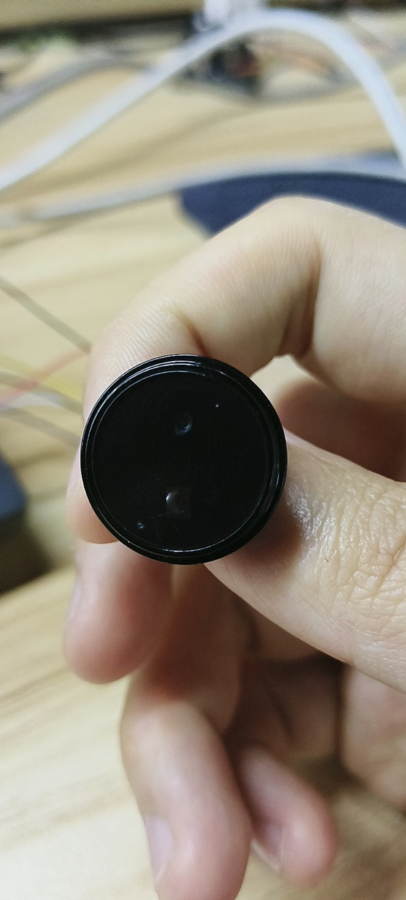
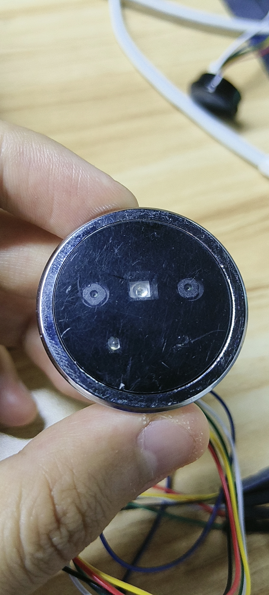

# DFRobot_Biometric
- [English Version](./README.md)

 FP001和FP002是人脸掌静脉识别模组，搭载仿生人脸识别算法，支持 UVC/UAC 方式传输，MJPEG 视
频格式，既实现了安全性，又兼具了良好的用户体验，具有功耗低、成本低、快速识别、外观
精致、产品结构小巧等特点，采用了高算力芯片，快速完成人脸识别和掌静脉识别的完整过程

Biometric库是对于这两个模块的功能进行统一的封装，FP002比FP001多了红外检测和一个三色可控制的指示灯，提供了人脸和掌静脉两种用户注册方式，识别效率高，反应精准快
，还有管理员用户功能，算法在模块内完成，本库主要进行指令交互，下达命令，接受反馈，命令响应及时 翻译一下<br>






## 产品链接 (www.dfrobot.com)

    SKU：SEN0736 FP001和SEN0737FP002人脸与掌静脉识别模块

## 目录

  * [概述](#概述)
  * [库安装](#库安装)
  * [方法](#方法)
  * [兼容性](#兼容性)
  * [历史](#历史)
  * [创作者](#创作者)

## 概述

本库实现了人脸与掌静脉注册用户，用户识别，用户的删除管理，获取用户数量，控制指示灯等功能

## 库安装

使用此库前，请首先下载库文件，将其粘贴到\Arduino\libraries目录中，然后打开examples文件夹并在该文件夹中运行演示。

## 方法

```C++
  /**
   * @fn checkState
   * @brief 确认模块是否就绪,是否空闲
   * @details 函数细节描述(简单函数可以不需要)
   * @param None (无，可以不需要)
   * @return bool类型
   * @retval true 就绪
   * @retval false 未就绪
   * @note 初始化或则执行某项命令前可以用check_state()函数检查状态
   * @attention 注意事项(没有可不需要)
   */
  bool checkState(void);

  /**
   * @fn enrollUser
   * @brief 对人脸或掌静脉进行识别
   * @details 函数细节描述(简单函数可以不需要)
   * @param kind FACE_USER表示进行人脸识别，PALM_USER表示进行掌静脉识别
   * @param userName  用户名称,字符长度为1~32
   * @return 返回任务执行结果
   * @retval NO_ACK -1 没有收到模块的reply指令
   * @retval ERROR  -2用户名字符串过长或传入了不存在的人脸参数
   * @retval 1 表示成功
   * @retval 2 表示重复
   * @retval 3 表示录入超时
   */
  int8_t enrollUser(uint8_t kind,const char* userName,uint16_t* id,eIsAdmin_t idAdmin);

  /**
   * @fn getAllNumsFaceUserIDs
   * @brief 获取人脸用户的数量
   * @details 函数细节描述(简单函数可以不需要)
   * @return 人脸用户的数量
   * @retval  NO_ACK -1 没有收到模块的reply指令
   */
  int16_t getAllNumsFaceUserIDs(void);

  /**
   * @fn getAllNumsPalmUserIDs
   * @brief 获取掌静脉用户的数量
   * @details 函数细节描述(简单函数可以不需要)
   * @return 掌静脉用户的数量
   * @retval NO_ACK -1 没有收到模块的reply指令
   */
  int16_t getAllNumsPalmUserIDs(void);

  /**
   * @fn getAllFaceUserIDs
   * @brief 获取具体有哪些人脸用户
   * @param id_buffer 存储人脸用户id的数组
   * @param length 传入的数组的长度
   * @return result
   * @retval NO_ACK -1 没有收到模块的reply指令
   * @retval ERROR  -2 传入的参数错误，比如传入的数组长度不足以存储所有id
   */
  int8_t getAllFaceUserIDs(uint16_t *id_buffer,uint16_t length);

  /**
   * @fn getRecognitionResult
   * @brief 对用户进行识别
   * @details 函数细节描述(简单函数可以不需要)
   * @param ID 存放识别到的用户信息
   * @return 执行结果
   * @retval NO_ACK -1 没有收到模块的reply指令
   * @retval 1 执行成功
   * @retval 2 超时
   * @retval 3 无此用户
   */
  int8_t getRecognitionResult(sId_t* ID);

  /**
   * @fn deleteUser
   * @brief 删除指定用户
   * @details 函数细节描述(简单函数可以不需要)
   * @param  id 用户的id号，范围1~800
   * @return 删除结果
   * @retval NO_ACK -1 没有收到模块的reply指令
   * @retval ERROR  -2  ID超出1~800的范围
   * @retval 1 删除成功
   * @retval 2 无指定用户
   * @retval 3 未知错误，建议再次删除
   */
  int8_t deleteUser(uint16_t id);

  /**
   * @fn deleteAllUser
   * @brief 删除所有用户
   * @details 函数细节描述(简单函数可以不需要)
   * @return 删除结果
   * @retval NO_ACK -1 没有收到模块的reply指令
   * @retval 1 删除成功
   * @retval 2 未知错误，建议再次删除
   */
  int8_t deleteAllUser(void);

  /**
   * @fn ledColor
   * @brief 控制led的状态
   * @details 函数细节描述(简单函数可以不需要)
   * @param color 灯的颜色，COLOR_GREEN 绿灯，COLOR_RED 红灯，COLOR_WHITE 白灯
   * @param kind LED_ON 开灯，LED_OFF 关灯
   * @return 执行结果
   * @retval NO_ACK -1 没有收到模块的reply指令
   * @retval ERROR -2 kind或color参数无效
   * @retval 1 执行成功
   */
  int8_t ledColor(uint8_t color, uint8_t kind);
```

## 兼容性

主板               | 通过  | 未通过   | 未测试   | 备注
------------------ | :----------: | :----------: | :---------: | -----
Arduino uno        |      √       |              |             |
Mega2560        |      √       |              |             |
Leonardo        |      √       |              |             |
ESP32           |      √       |              |             |
micro:bit        |      √       |              |             |


## 历史

- 2026/04/30 - 1.0.0 版本

## 创作者

Written by Olive-hy(feng.yang@dfrobot.com), 2026-4-30 (Welcome to our [website](https://www.dfrobot.com/))
